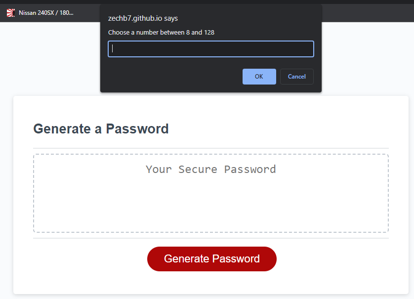
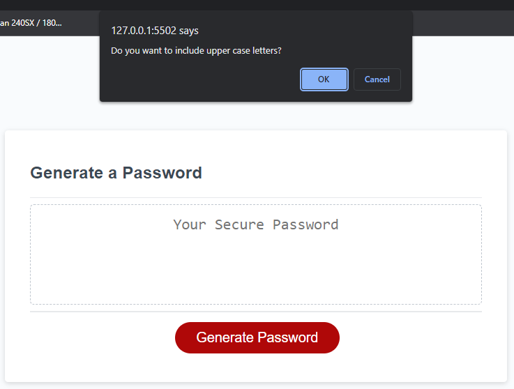
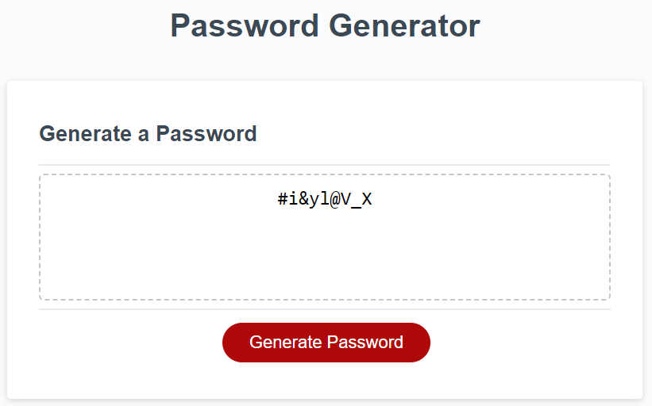

# Challenge3
Challenge 3 for UTA bootcamp 

A random password is generated when a user inputs a number within the given range and selects if they want to include upper case, lower case, special characters, and numbers.
After the users goes through the prompts the generated password is displayed in the box.

 ## User Experience
* A user clicks generate password and a prompt appears to choose a number between the range of 8-128.

    

* The user goes throught the next four prompts to choose whether to include upper and lower case letters, numbers, and specail characters.
 
    

* Once the user goes through all the prompts they see a password generated using their criteria.

    
